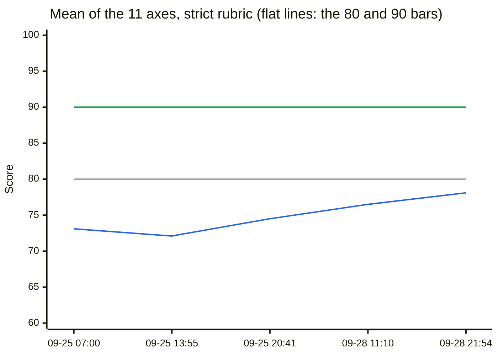
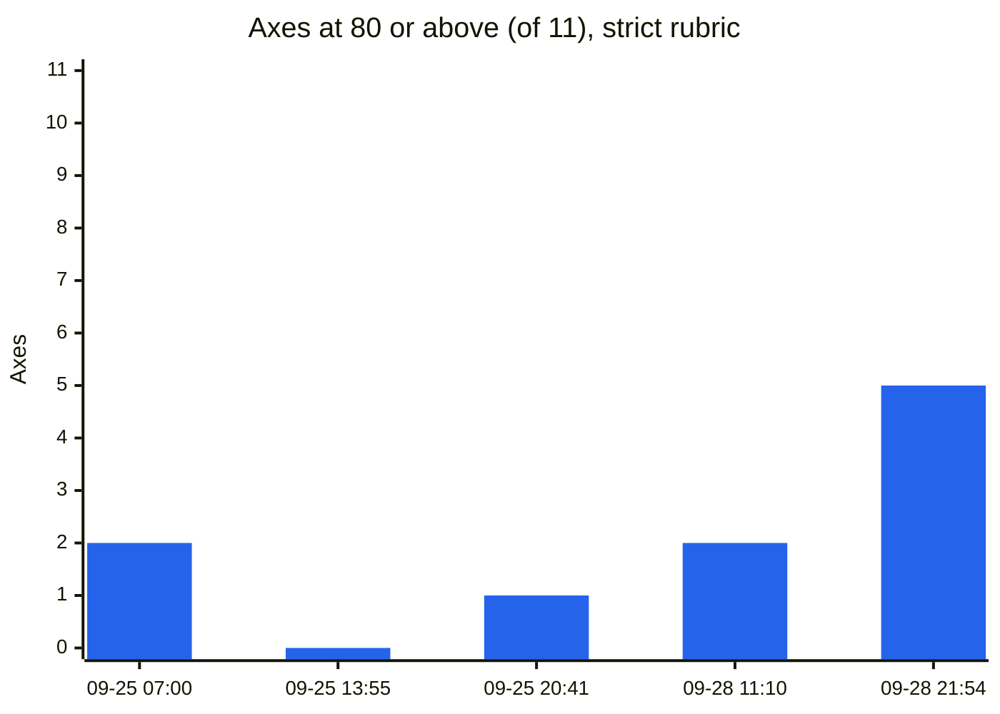
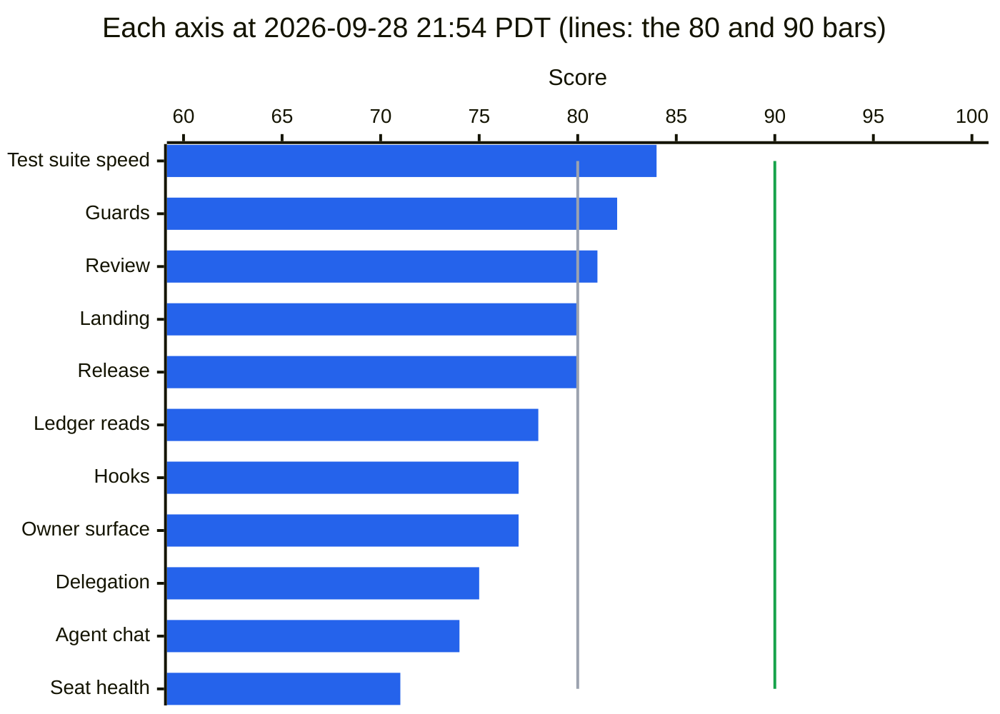

# The 11-axis agent-experience eval

helm is built to be worked in by agents, so the question that matters most is
what it is like to be one of those agents, and what it is like to be the one
human who runs them. helm tracks that on **11 axes**. Each axis gets a score
from 1 to 100 against a written rubric, and the rubric ties the scores that
matter (80 and 90) to a measurement.

This page gives the rubric, every scoring snapshot so far, and an honest
reading of where helm stands.

**What kind of score this is.** These are the maintainers' own scores: a
rubric the maintainers wrote, applied to measurements that read-only agents
took on the maintainers' own fleet. They are not a quorate cross-family
council in the sense of [COUNCIL_EVAL](methodology/COUNCIL_EVAL.md), and they
are not independent ratings. The [independent-rater battery](#the-independent-rater-battery)
below is how independent raters get a say, and only it can award a 90.

## At a glance

- **Latest strict snapshot (2026-09-28 21:54 PDT): mean 78.1, with 5 of 11
  axes at 80 or above and none at 90.** *Strict* means scored under the fixed
  rubric in [How it is scored](#how-it-is-scored).
- The first strict snapshot (2026-09-25 07:00 PDT) had a mean of 73.1, with 2
  axes at 80 or above. Across five strict snapshots the mean rose 5.0 points,
  and the count of axes at 80 or above went from 2 to 5.
- **The release bar.** The version number 0.3.5 is kept for a release that
  independent raters score at 90 or above on every axis. Those raters are
  near-state-of-the-art models, local or hosted, and each one works real helm
  tasks first. The bar is not met, so the release cut from these scores is
  **0.3.2**, not 0.3.5.

The rising line is the mean. The two flat lines are the 80 bar and the 90
bar. The snapshots are evenly spaced on the chart, but they were not evenly
spaced in time: three fall on 2026-09-25 and two on 2026-09-28. The
[results table](#results-over-time) has every number, if the chart does not
render where you are reading this.

## The 11 axes

| Axis | What it measures | 80 means (measured) | 90 means (measured) |
|---|---|---|---|
| Landing pipeline | How committed work reaches trunk | Every land has a serial receipt through land provenance and passes all five `helm lr foldcheck` rungs, and at least one land in the window was conducted end to end by a seat other than the integrator | Any seat lands through land provenance; zero capacity refusals that a queue could serve; median commit-to-trunk under 45 min; zero reverts |
| Hooks | Speed and reliability of the harness hooks helm installs | Stop hook p95 under 1 s over at least 2 h, and no hook timeout that is the hook's own fault rather than host load | Every hook p99 under 0.5 s under full load; zero hook timeouts |
| Land safety and guards | What stops a bad or leaking change before it ships | Land provenance is on, and a private name in a staged diff is refused at commit time (not first at the train's audits) | Every leak class is refused at commit time; classifier-ranked candidates with a measured false-positive rate under 1% |
| Delegation | How safely builder agents take scoped work and report it | A night with no builder incident that harmed the host or another seat, and every claim in a builder's report re-checked by a command | Every builder sandboxed from the host; every report claim checked by a command automatically; zero lost verdicts |
| Release process | How a public release is cut | A release is one in-repo command with a dry run that runs on the remote build fabric; no release tooling lives outside the repo | One in-repo command and a green nightly dry run; a public release in under 10 min, with one human approval click as the only human step |
| Test suite speed | How long an agent waits for a gate | Land gate under 12 min on the primary test host, or a median focused lane run under 3 min | Land gate under 6 min; focused lane run under 90 s |
| Owner surface | What the human operator has to read and decide | The morning report is complete, and at most 5 held source-clean rows remain that nothing can close | The morning report writes itself, and the operator's page lists only decisions that only the operator can make |
| Seat health | Whether agent sessions stay responsive | Over at least 2 h, no seat sits more than 10 min on a prompt, or idle while it owes a row; a runaway child process is ended automatically | No seat idle for more than 5 min while it owes work; prompts, context overages and runaways heal themselves; the operator never types into a pane |
| Ledger reads | How fast agents read shared state from the ledger fold | Post-land warm read under 30 s, measured on a real land | Every warm read under 1 s; post-land read under 5 s |
| Review process | How fast and how visibly work gets a cross-family review | Median dispatch-to-verdict under 20 min over the night; no verdict invisible on `helm lr show`; the meld review door is live | Median dispatch-to-verdict under 10 min; measured precision and recall for each reviewer model; design disputes open a pair meld that peers join |
| Agent chat | Whether agent-to-agent messages arrive, and get noticed | Over at least 2 h of traffic, zero DEGRADED or outcome-unknown sends, and rows that an idle seat owes are surfaced to it again | The doorbell is the default; zero DEGRADED sends; a meld invite is seen in under 10 s |

The terms in this table are helm's own states and verbs:

- **land provenance** is the rule that a land takes only a whole-suite receipt
  whose origin helm can prove (`helm gate provenance` prints its state);
- **foldcheck** is the five-rung check run on a landed head
  (`helm lr foldcheck`); with `--apply` it also closes the source-clean
  holds the land carried;
- a **source-clean** row is a review whose source read is clean and that waits
  for the land gate's whole suite;
- the **doorbell** is a seat's beacon: an idle seat with an armed beacon wakes
  when a row addressed to it arrives;
- a **DEAF** seat is one with no live beacon, so helm cannot wake it
  (`helm beacons` is the census);
- a **meld** is a shared room where two seats converge on one question;
- the **integrator** is the seat that runs trains and lands work;
- a **row** is one entry on the dispatch ledger: work or a review someone
  owes;
- the **build fabric** is the remote runner that runs test suites off the
  operator's machine;
- a **DEGRADED** send is a chat post whose signed transport failed (for
  example `node_unreachable`);
- a **warm read** is a ledger read served from the fold checkpoint rather
  than a rebuild.

[VERBS](VERBS.md) documents each verb. The ledger fold is described in
[FOLD_CHECKPOINT](FOLD_CHECKPOINT.md), the meld review door in
[MELD_REVIEW_DOOR](MELD_REVIEW_DOOR.md), and the review and land flow in
[LANDING](LANDING.md).

## How it is scored

**Scale.** Each axis gets a score from 1 to 100. A score is a judgment, but it
must rest on that day's measurements, and the snapshot quotes the measurement
next to the score. Scores between the marks say how close an axis is. Only the
80 and 90 marks are pass/fail.

**The strict rubric (the 80 column, fixed 2026-09-25 00:15 PDT).** An axis can
reach 80 only when its own bar is measured, and the snapshot that claims the 80
quotes the measurement. The rubric was fixed *before* the first attempt to lift
the mean past 80, so that no score could move without its measurement.

**The 90 column (fixed 2026-09-25 02:20 PDT).** An axis reaches 90 when two
things are true:

1. Telemetry measures the bar over at least 24 h for a release candidate.
2. Every independent rater scores the axis 90 or above, with evidence from its
   own session.

95 means the same bar held for 7 days.

**Who scores.** The maintainers' snapshots are scored by the fleet's
integrating agent. From 2026-09-25 13:55 PDT on, four read-only agents took the
measurements, and the integrating agent applied the rubric. These are the
maintainers' own scores. The independent battery below is how independent
raters get a say.

**Host load.** Latency axes (hooks, ledger reads, test speed) move with host
load, so each snapshot records it. At 2026-09-25 13:55 PDT the host ran at a
load of 38 on 8 cores, and hooks and ledger reads fell that day.

### The independent-rater battery

A 90 counts only when independent raters give it. The battery makes "an
independent rater" a repeatable instrument. Its sandbox project and rater
runner are not in this repository yet.

- **Real tasks, not a questionnaire.** Each rater joins as a helm seat in a
  throwaway sandbox project, so its lands and dispatches go to the sandbox's
  ledger and not to helm's. It then works seven tasks:

  | Task | What the rater does | Axes it exercises |
  |---|---|---|
  | T1 | Claim a task, build a small change, gate it on the build fabric, get a cross-family review, land it | Landing pipeline, test suite speed, review process |
  | T2 | The same, but the change carries a planted private name | Land safety and guards (refused at commit, not at the train) |
  | T3 | Answer an addressed row, hand off, compact, resume from the handoff | Agent chat, hooks, seat health |
  | T4 | Find and cure a seeded stuck seat (an idle seat that owes a row, and a runaway child) | Seat health, owner surface |
  | T5 | Delegate a scoped change to a builder, then check each claim it reports with a command | Delegation |
  | T6 | Answer five ledger questions, read the operator's page and list what needs the operator, run the release dry run | Ledger reads, release process, owner surface |
  | T7 | Open a pair meld with a peer from another model family on a seeded design dispute, and reach a typed agreement bound to the row | Review process, agent chat (invite seen in under 10 s) |

- **Own evidence only.** A rater scores all 11 axes, and each score cites a
  command from its own session and what that command showed. A score whose
  only evidence is the rubric's wording is void.
- **Telemetry alongside.** Beside the raters, the battery reads the same
  measurements from helm's telemetry (stop-hook p95, dispatch-to-verdict,
  post-land warm read, DEGRADED sends).
  When a rater's number and the measured number disagree, both are visible.
- **The falsifier.** Each round runs every rater twice. One run uses the
  release candidate. The other uses a copy of helm with one axis broken on
  purpose, and the rater is not told which axis. The breaks rotate:
  - the stop hook sleeps 3 s;
  - the doorbell is off;
  - land provenance is off;
  - `helm lr show` hides the latest verdict.

  A round counts only if every rater's score on the broken axis falls by 10
  or more while the other axes move by less than 5. Otherwise, no 90 from that
  round counts.

**Dry round (2026-09-26).** One rater ran the battery end to end, in about 6
hours: a local open-weights model (Qwen3.8-27B). It completed six of the seven
tasks and part of T4, without the degraded control. Its scores:

| Rater | Landing | Hooks | Guards | Delegation | Release | Test speed | Owner surface | Seat health | Ledger reads | Review | Chat | Mean |
|---|---|---|---|---|---|---|---|---|---|---|---|---|
| Qwen3.8-27B (local), dry round | 66 | 72 | 80 | 80 | 74 | 70 | 66 | 64 | 82 | 72 | 70 | 72.4 |

That round also filed five findings: four against helm and one against the
battery itself. The full battery has not run yet. It adds the degraded control
and raters from several model families.

## Results over time

The first two snapshots came before the strict rubric. They were judgments
grounded in that day's measurements, but no fixed bar yet tied a score to a
measurement, so they are **not comparable** with the later ones. Those columns
are in italics and are left off the charts. Rows are ordered by the
latest score.

| Axis | *09-24 21:05* | *09-25 00:12* | 09-25 07:00 | 09-25 13:55 | 09-25 20:41 | 09-28 11:10 | **09-28 21:54** |
|---|---|---|---|---|---|---|---|
| Test suite speed | *65* | *65* | 64 | 64 | 82 | 84 | **84** |
| Land safety and guards | *75* | *82* | 80 | 78 | 79 | 81 | **82** |
| Review process | *55* | *58* | 78 | 77 | 78 | 79 | **81** |
| Landing pipeline | *80* | *80* | 77 | 76 | 78 | 79 | **80** |
| Release process | *70* | *70* | 75 | 75 | 75 | 78 | **80** |
| Ledger reads | *60* | *62* | 82 | 76 | 78 | 77 | **78** |
| Hooks | *80* | *78* | 76 | 74 | 72 | 72 | **77** |
| Owner surface | *62* | *66* | 64 | 65 | 68 | 74 | **77** |
| Delegation | *72* | *72* | 74 | 70 | 70 | 72 | **75** |
| Agent chat | *40* | *55* | 68 | 69 | 72 | 76 | **74** |
| Seat health | *60* | *60* | 66 | 69 | 68 | 70 | **71** |
| **Mean** | *65.4* | *68.0* | 73.1 | 72.1 | 74.5 | 76.5 | **78.1** |
| **Axes at 80+** | *2* | *2* | 2 | 0 | 1 | 2 | **5** |

All times are PDT. The strict rubric starts at 2026-09-25 00:15 PDT, between
the second and third columns. A mean is the arithmetic mean of the 11 scores,
to one decimal. The first three snapshots gave rounded means when they were
written (about 65, about 68, and 73).

### What moved, snapshot by snapshot

- **2026-09-24 21:05 (before the rubric).** This was the first scorecard. The
  stop hook had just fallen from 12-20 s to p50 0.33 s and p95 0.82 s. Agent
  chat scored 40 because the chat node was down for most of the day.
- **2026-09-25 00:12 (before the rubric).** Land provenance went live. Signed
  chat came back, and agent chat rose 15 points.
- **The rubric was fixed at 00:15.** At 02:00, a forecast predicted a mean of
  about 73 by dawn, about 77 at best, and no mean of 80 that night.
- **2026-09-25 07:00 (the first strict snapshot).** The mean was 73.1, so the
  forecast held.
  - Guards was re-based to 80 when a commit-time refusal of a private name was
    measured.
  - Ledger reads reached 82: the post-land warm read fell from 213 s to 5 s
    over four lands.
  - Review reached 78: the overnight median dispatch-to-verdict was 13.0 min
    (n = 78).
  - The doorbell went live.
  - Test speed was 64: the land gate median was 16.3 min on the primary test
    host.
- **2026-09-25 13:55.** The mean fell to 72.1, and no axis was at 80.
  - The host ran at load 38 on 8 cores. The stop hook p95 reached 11.3 s, and
    the first post-land read took 34.5 s against a 30 s bar.
  - A lot of code landed that day, but little of it was switched on and
    measured against its bar yet.
- **2026-09-25 20:41.** Sliced land gates took test speed to 82.
- **2026-09-28 11:10.** This window covered 99 lands in 61.5 h. Measured over
  the week:
  - the land gate went from 16-19 min to about 4 min (median 242 s, n = 98);
  - median commit-to-trunk went from 228 min to 77 min;
  - median review latency went from 17-27 min to 4.7 min;
  - held rows that nothing could close went from 45 to 0.

  The nightly release dry run was green. Most of the 80 bars still open needed
  a measurement that did not exist yet, or a feature that was built but not yet
  switched on (auto-land was paused).
- **2026-09-28 21:54.** Three more axes crossed 80:
  - review: every read in the window was visible on `helm lr show`, and the
    median was 4.8 min (n = 55);
  - landing: auto-land conducted 5 of 20 merges, with 0 reverts;
  - release: no release tooling remains outside the repo, and the nightly dry
    run was green, though it ran 231 commits behind trunk.

## Where helm stands

As of 2026-09-28 21:54 PDT, five axes meet their 80 bar: test suite speed (84),
land safety and guards (82), review process (81), landing pipeline (80) and
release process (80).

Six do not. Each one is below 80 for a measured reason:

| Axis | Score | What keeps it under 80 |
|---|---|---|
| Ledger reads | 78 | The post-land read had no timing instrument at this snapshot (the `helm lr postland` timer landed 16 minutes later). A proxy reads about 7 s on auto-landed merges, but the bar asks for a measured real land |
| Hooks | 77 | Stop hook p95 was 1505 ms over 2.17 h (n = 112), with 0 timeouts. The bar is p95 under 1 s |
| Owner surface | 77 | The morning report is still written by hand, and `helm brief --report` missed some lands. (The held-rows leg is met: 0-1 rows at 11:10) |
| Delegation | 75 | 29 of 47 builder claims had no command bound to check them. Builder work also harmed shared resources: a local model ran out of GPU memory, and a ledger lock was held for 14 min |
| Agent chat | 74 | 8 sends were degraded (`node_unreachable`), and the idle re-ring fired 0 times in 9 h |
| Seat health | 71 | One idle seat that owed work sat for 15-20 min four times, and was not re-surfaced. 7 of 21 seats were DEAF |

**Two roots cover four of the six.**

- The idle re-ring (the doorbell ringing again for an idle seat that owes
  rows) is built, and did not fire once in 9 h. This holds back agent chat
  and seat health.
- The report of record is still written by hand (`helm brief --report`
  missed lands), and builder claims are not yet bound to
  a checking command. This holds back owner surface and delegation.

Hooks needs the stop hook under 1 s at load. Ledger reads now has its
instrument: the post-land read timer (`helm lr postland`) landed at 22:10 PDT,
after this snapshot, and the next snapshot scores the axis from it.

**No axis is at 90.** Where the 90 legs have a number, they show the distance:

- **Test suite speed** is the closest. The land-gate leg (under 6 min) is met,
  at a median of 277 s. The focused-run leg (under 90 s) is not: focused audit
  runs had a median of 118 s (n = 73) when last measured (2026-09-28 11:10).
- **Review process** meets the latency leg: a median of 4.8 min against 10 min.
  Two legs are not scored yet: precision and recall for each reviewer model,
  and pair melds for design disputes.
- **Landing pipeline** had zero reverts. Median commit-to-trunk was 77 min,
  against a 45 min bar.
- **Agent chat** needs zero DEGRADED sends. There were 8 in the last window.

Every 90 also needs the full independent battery, and that has not run.

## What is next

In the order the evidence points to:

1. **Make the idle re-ring fire.** An idle seat that owes a row must hear
   about it again. This moves agent chat and seat health.
2. **Make `helm brief --report` complete enough to replace the hand-written
   morning report, and bind every builder claim to a checking command.** This moves owner surface and delegation.
3. **Get the stop hook under 1 s p95 at load.** This moves hooks.
4. **Score ledger reads from the post-land read timer** (`helm lr postland`,
   landed after this snapshot), so that ledger reads is measured, not
   estimated.
5. **Run the full independent battery.** Use raters from several model
   families and the degraded control. Only that battery can clear 90, and so
   ship 0.3.5.

## Reading these numbers

- **The first two snapshots are not comparable.** Snapshots before 2026-09-25
  00:15 PDT came before the strict rubric. They are shown for completeness
  only. For example, the 82 for guards at 00:12 was later re-based.
- **These are self-scores until the battery runs.** They are bound to
  measurements, but the maintainers' own agents took them. The one dry round
  above is the only score so far from the independent battery.
- **One fleet, one workload.** Every snapshot measures one live fleet at work
  on helm itself. The fleet is a mixed-model team (Claude, Codex/GPT, Gemini,
  Kimi, Grok and local open-weights models) on Linux. A different fleet or
  workload can score differently.
- **Uneven spacing.** The charts space the snapshots evenly. The table gives
  the real times.

## Related instruments

- **Per-model record.** `helm eval board` is a different, live scorecard: each
  model's record on real lanes, blended with a public benchmark prior, with a
  sample size and a band. It rates the models in a fleet, not helm.
- **Councils.** For a separate method, in which cross-family councils rate a
  system and then re-rate it on the identical prompt, see
  [COUNCIL_EVAL](methodology/COUNCIL_EVAL.md).
